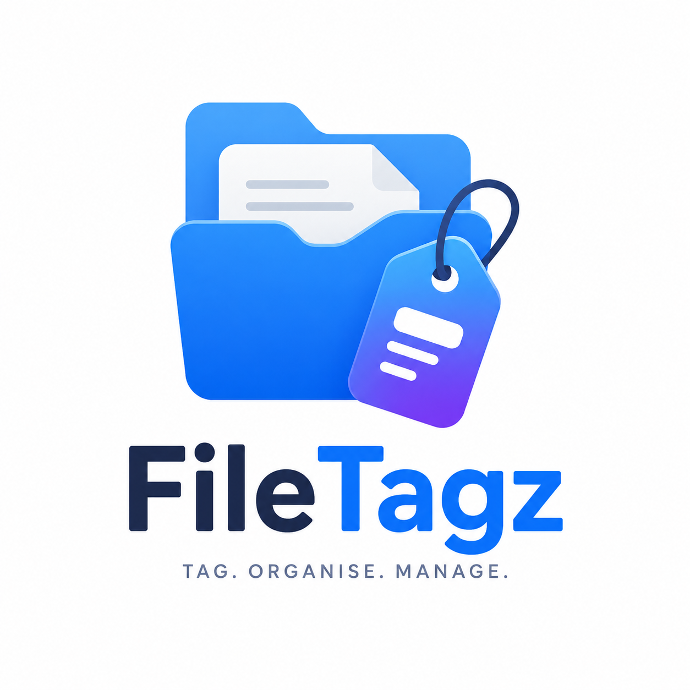

<div align="center">
  
  <h1>FileTagz</h1>
  <p><b>Premium color file-tagging & secure vault utility for Windows</b></p>
</div>

## 🌟 Overview
**FileTagz** is a modern, glassmorphic Windows utility that brings macOS-style color tagging to the native Windows File Explorer. Beyond just organizing files visually, FileTagz features a powerful **Secure Vault** mechanism that can completely hide tagged files at the OS level, keeping them safe behind a user-defined password.

Built with an **Electron** frontend and robust **Windows Shell integration**, FileTagz offers a seamless context menu experience right where you need it.

---

## ✨ Key Features
- 🎨 **Visual Color Tags**: Tag your files and folders with customizable color indicators.
- 🖱️ **Shell Extension**: Full integration into the Windows Right-Click Context Menu for quick tagging.
- 🔒 **Secure Vault**: Hide tagged files using OS-level system attributes. Access is protected by a custom master password.
- 🛡️ **UAC Integration**: Secure password-recovery and system-level operations backed by Windows User Account Control.
- 💫 **Premium Interface**: A sleek, fully responsive, glassmorphic tag manager UI.
- 🗄️ **Local Database**: Fast, lightweight tracking of tagged files using a normalized JSON database.

## 🚀 Getting Started

### Prerequisites
- Windows 10 or 11
- [Node.js](https://nodejs.org/) (v16+)
- Git

### Installation

1. **Clone the repository:**
   ```bash
   git clone https://github.com/Ayaan3216/FileTagz.git
   cd FileTagz
   ```

2. **Install dependencies:**
   ```bash
   npm install
   ```

3. **Register Windows Context Menu:**
   For right-click functionality in File Explorer, run the registry setup:
   - You can execute `register_context_menu.ps1` to integrate with the shell.
   - To remove it later, run `unregister_context_menu.ps1`.

### Running the App Locally
Start the Electron development server:
```bash
npm start
```
*(Or run `npm run dev` for dev-mode)*

---

## 🛠️ Building for Production

FileTagz can be built into standalone Windows installers or AppX packages.

```bash
# Build an AppX package (Windows Store format)
npm run build

# Build a standard Windows NSIS installer (.exe)
npm run build:exe

# Build both AppX and NSIS
npm run build:all
```
Your compiled applications will be available in the `/dist` directory.

---

## 📂 Project Structure
- `src/` - The frontend HTML/CSS/JS for the glassmorphic manager UI.
- `main.js` - The main Electron process handling OS-level interactions, vault logic, and database operations.
- `preload.js` - Secure IPC bridge between the UI and backend logic.
- `context_menu.reg` / `*.ps1` - Scripts for adding/removing Windows Explorer shell extensions.
- `repair_db.js` / `normalize_db.js` - Utilities for fixing and maintaining the local `tags.json` state.

## 🤝 Contributing
Contributions, issues, and feature requests are welcome! Feel free to check the [issues page](https://github.com/Ayaan3216/FileTagz/issues).

## 📄 License
This project is licensed under the MIT License - see the [package.json](package.json) file for details.

---
<div align="center">
  <i>Developed with ❤️ by Ayaan4uThere</i>
</div>
